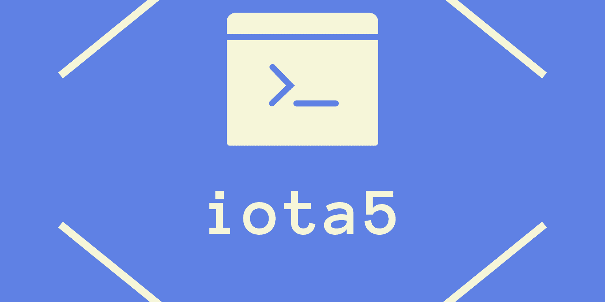

# The iota5 Programming Language

The **iota5** is a script programming language with a interpreter.



---

## Install

### Golang

```sh
$ go get github.com/iota5-lang/iota5
```

### Download

* [https://github.com/iota5-lang/iota5/releases](https://github.com/iota5-lang/iota5/releases)

## Usage

```sh
 $ iota5 file.i5
```

## Community

* [Gitter](https://gitter.im/iota5-lang/community?utm_source=share-link&utm_medium=link&utm_campaign=share-link)
* [Discord](https://discord.gg/nFhr9mx)

## License

This project is licensed under the [GPLv3 License](LICENSE).
